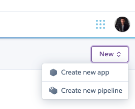
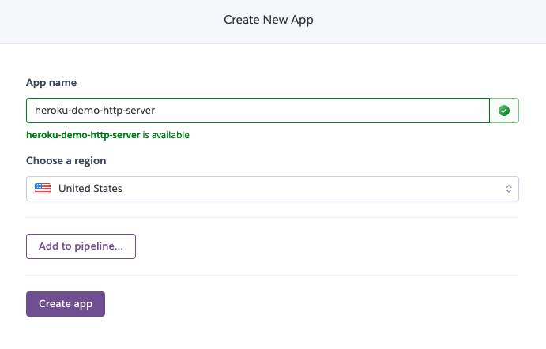
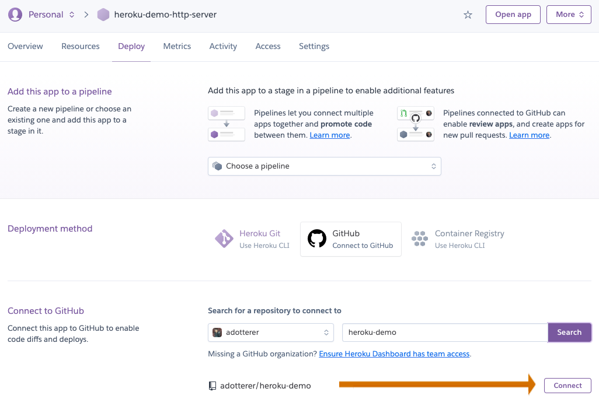
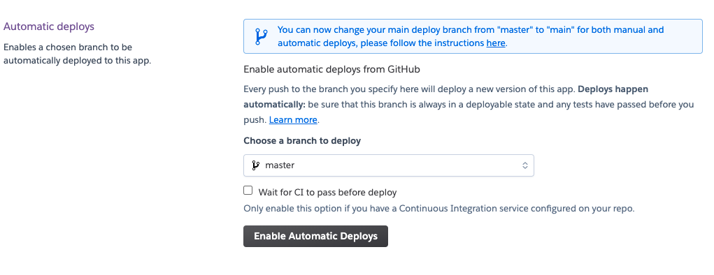
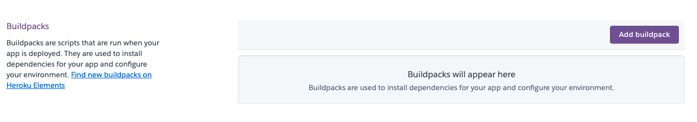
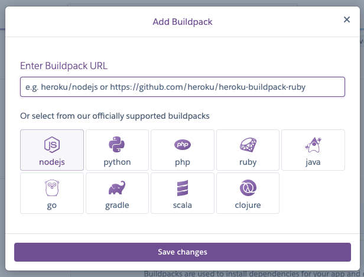
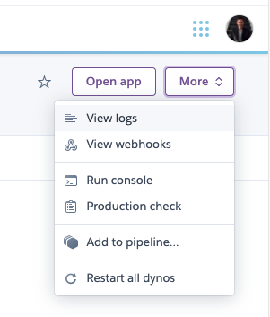
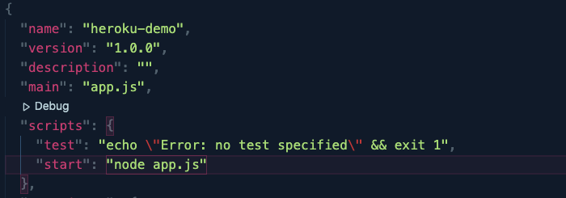
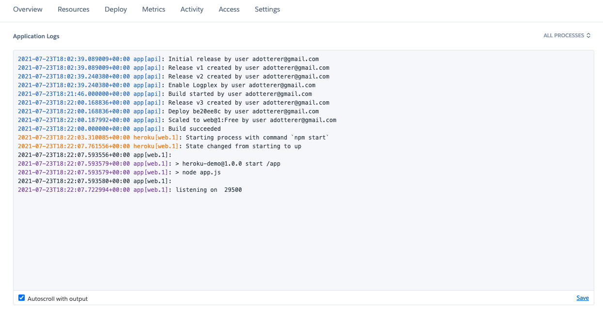

# Deploy an HTTP Server to Heroku

## In 9 easy steps

1. Go to [DashBoard](https://dashboard.heroku.com/apps) and under _New_ click _Create new app_ under _New_

2. Enter your App name and click _Create app_

3. Under the _Deploy_ tab (should be redirected here) choose GitHub and connect your repo.

   **_WARNING_** DO NOT CHOOSE AN APP WITH A DATABASE

4. After you connect you should see this. Then, enable Automatic Deploys (make sure you choose the branch you want to deploy-- probably master or main).

5. Go to the _Settings_ tab and click _Add buildpack_. Choose Nodejs and _Save Changes_

6. Open _View logs_ in _More_ so we can view the build of our app in the Heroku terminal and catch any potential errors (keep this tab open for the following steps)

7. Go to the Github repo on your local computer. Ensure that (1) you have a package.json file, and (2) node is running your server file in the _scripts_ portion of the package.json. You may have to add a start script yourself:

8. Now when you add, commit, and push to your Github repo you should see a new build begin in the Heroku terminal (it might take a few seconds to get started). Any potential errors will be in this terminal.

9. Go to your Heroku app (you can click _Open app_) and profit!

